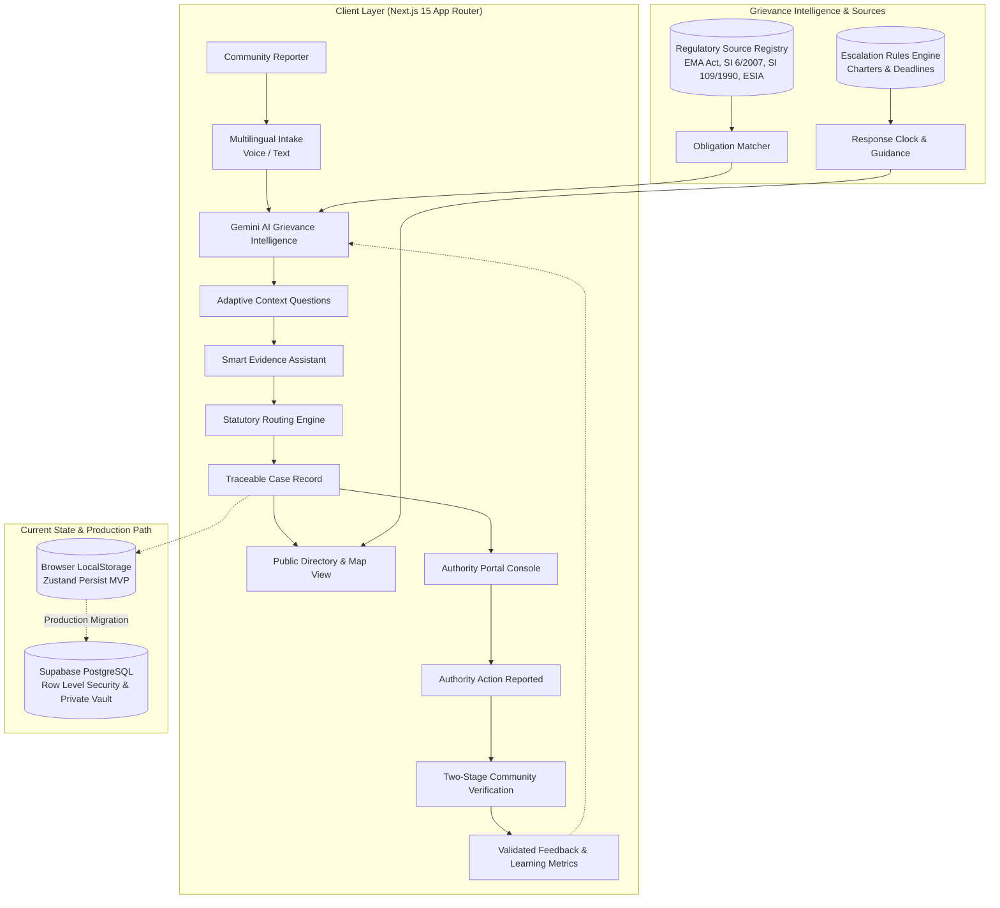

# MineVoice

**Speak up. Route it right. Track what happens.**

> A multilingual grievance intelligence and public accountability platform for mining-affected communities.

---

MineVoice is a multilingual grievance intelligence and public accountability proof of concept for mining-affected communities in Zimbabwe. It helps community members describe concerns in their own words and languages (English, Shona, Ndebele, and Swahili), converts unstructured testimony into structured civic grievances, identifies relevant regulatory authorities and statutory obligations, tracks what happens next, and makes anonymised community issues visible without exposing complainants to personal risk.

Built for the **Open Society Foundations × Andela “Information You Can Trust” Hackathon**.

* **Primary Challenge Track:** Transparency & Accountability
* **Secondary Alignment:** Stability & Social Cohesion | Safety, Reporting & Protection

---

## Quick Links

- 🎥 **Demo Video:** `[Add 3-minute video link]`
- 📑 **Pitch Deck:** [Pitch deck](https://canva.link/07j86ojqz91g89w)
- 🧪 **Demo Guide:** [Jump to Running the Hackathon Demo](#running-the-hackathon-demo)
- 🛠 **Run Locally:** [Jump to Getting Started](#getting-started)

---

## The Problem

Mining operations frequently create acute community concerns involving:

* Contamination of communal drinking water and boreholes by processing effluent;
* Open-cast blasting shockwaves causing structural cracks in homes without advance warning sirens;
* Heavy silica dust emissions from unpaved ore haulage roads near schools and villages;
* Uncompensated land loss, forced relocation, and boundary disputes;
* Unfulfilled commitments in Environmental and Social Impact Assessment (ESIA) permits and Community Development Agreements (CDAs).

In practice, the obstacle is rarely a community's willingness to speak. The breakdown occurs at the boundary between lived experience and institutional bureaucracy:

> **The Central Information Failure:** Communities are expected to translate complex, stressful lived experiences into bureaucratic categories and statutory citations before any formal institution will listen.

When a villager notices discoloration in a drinking borehole, they must determine whether the issue belongs with:
* The **Environmental Management Agency (EMA)** (effluent discharge and water pollution);
* The **Ministry of Mines and Mining Development** (mining safety, concession boundaries, and blasting regulations);
* The **Rural District Council (RDC)** (communal land, roads, and local social infrastructure);
* The **Zimbabwe Human Rights Commission (ZHRC)** (constitutional environmental and livelihood rights);
* Or an internal **mining company grievance liaison**.

Critical governance records exist in silos—in the *Environmental Management Act [Cap 20:27]*, *Statutory Instruments (SI 6/2007, SI 109/1990)*, council minutes, ESIA license conditions, and community development compacts. Once a complaint is filed, it vanishes into administrative queues with no public tracking, no standard response clock, and no independent channel to verify whether an authority's claimed "resolution" actually fixed the problem on the ground.

*MineVoice does not adjudicate legal liability or prove misconduct. It bridges this structural information divide by structuring, routing, tracking, and verifying civic grievances through transparent public records.*

---

## The Core Idea

```text
Tell us what happened (Voice or Text in English, Shona, Ndebele, Swahili)
        ↓
Understand the grievance (Multilingual language extraction & plain-language translation)
        ↓
Ask missing questions (Adaptive, context-aware follow-ups)
        ↓
Organise supporting evidence (Smart Evidence Assistant & privacy-safe geotagging)
        ↓
Suggest the relevant authority (Statutory jurisdiction matching: EMA, Mines, RDC, ZHRC)
        ↓
Match relevant obligations (Grounded in verified regulatory source registry)
        ↓
Create a traceable case (Reference ID, public summary, private details separated)
        ↓
Track authority action (Operational triage, response clock, demo inspection dispatch)
        ↓
Community verifies the outcome (Two-stage resolution verification)
        ↓
Validated feedback improves future routing (Operational learning metrics)
```

### Core Operating Principles

1. **Public issue. Private complainant.**
   Community harms are public matters; personal identities and exact household locations are private. MineVoice decouples the public accountability record from personal reporter data.
2. **Non-adjudicative intelligence.**
   MineVoice does not issue verdicts, declare guilt, or claim legal breaches. It identifies *Potential obligation matches* against public legal instruments and helps citizens navigate the formal administrative landscape.
3. **No one-sided closure.**
   An authority claiming "resolved" does not close the truth loop. Accountability requires ground verification by the community experiencing the impact.

---

## What MineVoice Does

| Capability | What It Does in the Repository |
| ---------- | ----------------------------- |
| **Multilingual Grievance Intake** | Supports audio recording and text intake in **English**, **Shona** (*ChiShona*), **Ndebele** (*isiNdebele*), and **Swahili** (*Kiswahili*). Preserves the original community voice while producing structured English summaries for formal routing. |
| **Voice & Text Processing** | Ingests spoken audio via browser `MediaRecorder` or text input. Transcribes and analyzes accounts using Google GenAI (`gemini-3.6-flash`), with deterministic rule-based fallbacks if offline or unconfigured. |
| **Adaptive AI Questioning** | Dynamically identifies missing context (dates first noticed, ongoing vs. past events, immediate life-safety dangers, prior institutional reports) without overwhelming the reporter. |
| **Smart Evidence Assistant** | Provides category-tailored evidence checklists (photographs with scale, water appearance notes, witness corroboration) and an evidence completeness gauge without invalidating oral testimony. |
| **AI-Assisted Classification** | Categorizes issues into seven defined mining governance domains (*Water & Pollution*, *Air, Dust, Noise & Blasting*, *Land & Access*, *Compensation & Relocation*, *Safety & Harm*, *Community Commitments*, *Other / Unsure*). |
| **Intelligent Authority Routing** | Recommends relevant institutions (EMA, Ministry of Mines, RDC, ZHRC, Company) accompanied by clear statutory justifications and confidence levels. |
| **Automated Obligation Matching** | Matches grievance facts against verified statutory instruments (e.g. *EMA Act Section 57(1)*, *SI 6 of 2007*, *SI 109 of 1990*, *ESIA License Conditions*), labeled explicitly as *Potential obligation matches*. |
| **Public Grievance Directory** | Filterable, searchable public registry displaying anonymised case reference numbers, categories, status badges, timelines, and response clocks. |
| **Privacy-Preserving Geotagging** | Allows reporters to capture GPS coordinates while enforcing precision reduction (`precise`, `approximate`, `ward_only`) and sensitive location obfuscation for the public directory. |
| **Accountability Relationship Graph** | Interactive visual node graph linking *Project → Grievance → Matched Obligation → Authority → Action Taken → Community Verification*. |
| **Authority Portal Demo** | Operational console for regulators to review incoming dossiers, acknowledge receipt, schedule demo field inspections, report corrective actions, and access coordinate audit logs. |
| **Response Clock & GuidanceCard** | Computes waiting duration against verified service charters (e.g. EMA 5-day client charter intake standard) and displays actionable "What happens next" plain-language guidance. |
| **Two-Stage Resolution Verification** | Prevents premature case closure by allowing community members to independently vote: *Verified resolved*, *Partially resolved*, *Resolution disputed*, or *Unable to verify*. |
| **In-App Follows & Alerts** | In-app notification center allowing users to monitor updates across projects, wards, categories, and individual case references. |

---

## Why AI?

### AI Where Language and Complexity Are the Bottleneck

MineVoice employs generative AI where human translation, classification, and regulatory navigation create barriers for citizens:

* **Language Detection & Transcription:** Captures local dialects and vernacular audio without requiring literacy in English legal terms.
* **Extraction of Structured Facts:** Extracts dates, locations, symptoms, and impacts from natural, emotional narratives.
* **Adaptive Questioning:** Generates concise follow-up inquiries targeted strictly at missing operational details.
* **Regulatory Obligation Mapping:** Searches indexed statutory instruments to suggest relevant clauses that an ordinary citizen would have no reason to know by heart.
* **Public-Safe Summarisation:** Synthesizes clear, factual summaries suitable for public transparency while redacting identifying details.

### What AI Does NOT Decide

To maintain civic trust and prevent algorithmic overreach, MineVoice enforces strict guardrails:

* ❌ **AI does not determine legal guilt or innocence.**
* ❌ **AI does not certify whether an environmental violation occurred.**
* ❌ **AI does not evaluate the financial adequacy of compensation offers.**
* ❌ **AI does not replace regulatory inspectors, laboratories, or judicial processes.**
* ❌ **AI outputs are never labeled as legal findings.** The platform uses *Potential obligation match*, never *Breach detected* or *Violation confirmed*.

> *AI assists with translation, structure, and navigation. Real people—community members, field inspectors, civil society advocates, and regulatory authorities—remain the arbiters of truth and verification.*

---

## The Learning Loop

```text
Community Grievance
       ↓
AI Classification & Routing Suggestion
       ↓
Reporter Review & Human Confirmation
       ↓
Authority Triage (Accepted, Redirected, or Clarification Requested)
       ↓
Field Action / Inspection Reported
       ↓
Community Ground Verification (Resolved / Partial / Disputed)
       ↓
Validated Outcome Feedback
       ↓
Improved Few-Shot Prompts, Classifier Rules & Evaluated Benchmarks
```

### Responsible Learning Protocol

MineVoice does **not** blindly retrain machine learning models on unverified complaint text. Instead:
1. Corrections made by reporters and authorities are tracked via internal **Learning Metrics** (classification accuracy percentage, routing redirect rates, dispute frequency).
2. Human-verified grievance outcomes form a structured benchmark dataset used for offline evaluation, prompt calibration, and future supervised fine-tuning.
3. This ensures spurious or malicious submissions cannot poison the routing intelligence.

---

## Example User Journey

> **Demo Scenario — Fictional Demonstration Data**

1. **Intake in Shona:**
   A farmer in Chikwaka Village near the fictional **Mavambo Lithium Project** notices discoloured borehole water and foul-smelling chemical foam. Using their phone, they choose **Speak** and record in Shona:
   > *"Chitubu chemumusha cheWard 14 chakasvibiswa nemvura ine madhaka emakemikari anobva kumuchina wekugezesa lithium. Mhuri 40 dzinotambura nemvura yekunwa."*
2. **AI Translation & Extraction:**
   MineVoice transcribes the audio, detects Shona (`sn`), and produces an accurate English synthesis: *"Ward 14 village natural spring and community borehole contaminated by chemical slurry runoff from lithium processing circuit. 40 families affected."*
3. **Adaptive Questioning:**
   The engine asks two targeted follow-ups:
   * *When did the discoloration first begin?* (Farmer answers: "Three days ago after heavy rain.")
   * *Is there an immediate danger to livestock or drinking water?* (Farmer flags: "Yes, drinking water.")
4. **Evidence & Location Guidance:**
   The Smart Evidence Assistant suggests photographing the borehole spout with a clean container to document color and sediment. The farmer captures approximate GPS coordinates with **Ward-level privacy protection** enabled.
5. **Obligation Matching:**
   MineVoice scans the configured regulatory registry and links two potential matches:
   * *EMA Act [Cap 20:27] Section 57(1)* (Prohibition against discharge of toxic pollutants);
   * *Mavambo Lithium ESIA Permit Condition 6.1* (Requirement to monitor communal boreholes within 3km and provide clean water bowsers if anomalies occur).
6. **Statutory Routing:**
   The platform recommends routing to the **Environmental Management Agency (EMA)** (primary environmental mandate) and the **Goromonzi Rural District Council** (custodian of communal water infrastructure).
7. **Traceable Public Case Created:**
   The case is registered as **`MG-2026-024`**. An anonymised entry appears in the Public Issues Directory. The complainant receives a reference link with a Response Clock based on EMA’s 5-day charter intake standard.
8. **Authority Triage & Action:**
   In the Authority Portal, an EMA District Officer reviews the dossier, assigns an environmental inspector for water sampling, and later logs a corrective action: *"Borehole flushed, tailings berm reinforced, water bowser dispatched."* Case status moves to `Awaiting community verification`.
9. **Community Verification:**
   Ward 14 residents inspect the borehole. The chemical foam has ceased, but water flow remains low. The community logs a verification vote: **Partially resolved**, noting that drinking water tankers must continue until lab test results are published. The timeline reflects this authentic ground truth.

---

## Trust Model

To combat misinformation and avoid unsubstantiated claims, MineVoice labels every record and timeline update with explicit trust tiers:

| Trust Tier | Definition | Example in MineVoice |
| ---------- | ---------- | -------------------- |
| **Verified** | Supported by an authoritative, documented public record, government gazette, or certified lab report. | Statutory citation from *EMA Act [Cap 20:27]* or official gazetted council boundary. |
| **Reported** | Documented by a credible external institution, published news source, or NGO monitoring group, but not independently verified on the ground by MineVoice. | Civil society water testing memo or regional health clinic advisory. |
| **Community reported** | Direct, first-hand testimony submitted by a community member or community-based monitor. | Initial citizen report of blasting vibrations or stream discoloration. |
| **Disputed** | Formal disagreement where the operating entity or regulator claims resolution, but affected residents assert the hazard continues. | Authority reports "water cleared", but community ground check reports ongoing contamination. |
| **Not publicly verifiable** | Information that cannot currently be cross-referenced against public registers, company disclosures, or satellite records. | Unregistered sub-contractor arrangements or unrecorded verbal commitments. |

> **Trust Principle:** Missing public documentation is never treated as proof of illegality or corporate wrongdoing. It is labeled transparently as unverified.

---

## Public Issue, Private Complainant

MineVoice separates public civic data from sensitive personal identifiers to protect community reporters from retaliation or intimidation:

```text
┌────────────────────────────────────────────────────────┐
│ PUBLIC ACCOUNTABILITY LAYER (Visible in Directory & Map)│
│ • Anonymised Reference Number (e.g., MG-2026-018)     │
│ • Category & Subcategory                              │
│ • Associated Mining Concession / Project Name         │
│ • Factual Summary in English and Original Language    │
│ • Coarse / Ward-Level Geolocation (Jittered Coordinates)│
│ • Matched Statutory Obligations                       │
│ • Authority Triage Status & Response Clock            │
│ • Public Timeline Events & Community Verification Votes│
└────────────────────────────────────────────────────────┘
                           ▲
             [Cryptographic Separation Barrier]
                           ▼
┌────────────────────────────────────────────────────────┐
│ PRIVATE COMPLAINANT LAYER (Restricted / Local Storage) │
│ • Reporter Name, Phone Number, WhatsApp Contact        │
│ • Original High-Fidelity Audio Recordings              │
│ • Exact Household GPS Coordinates                      │
│ • Private Witness Details & Sensitive Photographs      │
│ • Internal Regulatory Coordinate Access Logs (Audited) │
└────────────────────────────────────────────────────────┘
```

*Note on Prototype Storage:* In this hackathon proof of concept, private data separation is implemented via client-side architecture and selective state projection. Production deployment requires hardware-isolated Row Level Security (RLS) and encrypted database enclaves.

---

## Two-Stage Resolution Verification

Standard complaint management software treats an authority's update as the definitive end of the story:

```text
Traditional Workflow:
Citizen Complaint ───> Authority Reviews ───> Authority Says "Resolved" ───> Case Closed ❌
```

This structural flaw allows authorities or companies to log cosmetic administrative actions while problems persist on the ground. MineVoice introduces **Two-Stage Resolution Verification**:

```text
MineVoice Verification Loop:
Citizen Complaint ───> Authority Action Reported
                              │
                              ▼
                 [Awaiting Community Verification]
                              │
         ┌────────────────────┼────────────────────┐
         ▼                    ▼                    ▼
   Fully Resolved      Partially Resolved   Resolution Disputed
  (Problem solved)    (Interim relief only)  (Hazard ongoing)
```

The community holds the final say. A case is only marked `Verified resolved` when residents confirm that clean water is flowing, dust has subsided, or damaged structures have been repaired.

---

## Screenshots

| View | Description | Preview |
| ---- | ----------- | ------- |
| **Multilingual Grievance Intake** | Audio and text reporting interface with instant Shona/Ndebele language detection and adaptive follow-up questions. | `[Screenshot: /report - Voice & Text Intake]` |
| **Public Grievance Directory** | Filterable public dashboard showing live cases, status badges, response clocks, and geographic filters. | `[Screenshot: /issues - Public Directory]` |
| **GuidanceCard & Case Detail** | Detail view featuring the What Happens Next guidance engine, matched statutory obligations, and response clock. | `[Screenshot: /issues/MG-2026-018 - Case Details]` |
| **Authority Portal** | Administrative console for regulators to review dossiers, assign inspectors, and log corrective actions. | `[Screenshot: /authority - Authority Management]` |
| **Accountability Relationship Graph** | Interactive node visualizer connecting projects, grievances, statutory rules, and verification outcomes. | `[Screenshot: Accountability Graph Component]` |

---

## Architecture



---

## Current Persistence Architecture

To enable instant, frictionless testing by hackathon reviewers without database provisioning hurdles, the capstone MVP uses **Zustand with persistent browser storage**:

* **Storage Key:** `minevoice-storage-v2` in browser `localStorage`.
* **State Managed:** Active cases, seed cases, regulatory sources, project registry, authority profiles, in-app notification center, and coordinate access logs.
* **Refreshes & Sessions:** All newly filed grievances, evidence uploads, inspection assignments, and community verification votes persist across browser reloads on the same machine.
* **Deterministic Fallback:** If no Gemini API key is configured in the environment, the server action gracefully falls back to deterministic keyword-and-rule extraction, ensuring the workflow never crashes during evaluation.

> *Transparency Note:* Browser `localStorage` is explicitly a hackathon proof-of-concept persistence mechanism and is **not** suitable for multi-user production deployments across separate devices.

---

## Production Backend Path

### From Proof of Concept to Deployment

A production deployment of MineVoice would transition from client-side persistence to an enterprise civic backend (such as **Supabase / PostgreSQL**):

```text
[Community Reporter Device]
            │
            ▼
[Supabase Auth & Ephemeral Tokens]
            │
    ┌───────┴────────────────────────────┐
    ▼                                    ▼
[Private Tables - RLS Enforced]   [Public Anonymised Tables]
 • Complainant PII                 • Sanitised Public Dossiers
 • Raw Audio & Documents           • Truncated Geodata (Ward level)
 • Accurate GPS Points             • Matched Obligations & Timelines
 • Audit Access Trail              • Aggregated Community Votes
            │                                    │
            └─────────────────┬──────────────────┘
                              │
                              ▼
             [Row Level Security & Webhook Events]
                              │
                              ▼
            [Authority Portal / SMS Dispatch Bridge]
```

### Planned Production Components

1. **PostgreSQL with PostGIS:** Spatial clustering for incident hotspot detection without revealing household coordinates.
2. **Row Level Security (RLS):** Cryptographically restricts access to private complainant details so that even portal administrators only see anonymised identifiers unless audited consent is granted.
3. **Encrypted Object Storage:** Private S3/Supabase storage buckets for sensitive photographs and voice notes with virus and metadata stripping (EXIF sanitisation).
4. **Offline USSD / SMS Bridge:** Integration with SMS gateways (e.g. Africa's Talking) allowing community members with basic feature phones to submit reports and receive status updates.

---

## Scalability

MineVoice is architected to separate the **reusable core engine** from **country-specific jurisdiction packs**:

```text
┌────────────────────────────────────────────────────────┐
│                   REUSABLE CORE ENGINE                  │
│ Grievance Intake • Audio Transcription • Classification │
│  Evidence Checklist • Privacy Shrouding • Response Clock│
│  Accountability Graph • Two-Stage Verification Loop     │
└────────────────────────────────────────────────────────┘
                           │
       ┌───────────────────┴───────────────────┐
       ▼                                       ▼
┌─────────────────────────────┐ ┌─────────────────────────────┐
│    ZIMBABWE & REGIONAL      │ │ FUTURE CONTINENTAL EXPANSION│
│   CORRIDOR JURISDICTION     │ │    (e.g. DRC, ZAMBIA, GHANA)│
│ • EMA Act [Cap 20:27]       │ │ • DRC Mining Code (2018)    │
│ • SI 109/1990 (Blasting)    │ │ • Zambia EMA Act (2011)     │
│ • SI 6/2007 (Effluent)      │ │ • Ghana Minerals Commission │
│ • English, Shona, Ndebele,  │ │ • French, Lingala, Bemba,   │
│   Swahili (Kiswahili)       │ │   Twi, Portuguese           │
│ • Goromonzi, Zvishavane     │ │ • Katanga, Copperbelt Wards │
└─────────────────────────────┘ └─────────────────────────────┘
```

> *Zimbabwe is the first configured proof-of-concept jurisdiction, not a hard-coded assumption about how every African mining jurisdiction functions.*

---

## Tech Stack

| Layer | Technology | Repository Details |
| ----- | ---------- | ------------------ |
| **Framework** | Next.js 15.4.9 (App Router) | Server Actions, React Server Components, TypeScript |
| **Runtime & UI** | React 19.2.1 | Functional components, hooks, responsive modern UI |
| **Language** | TypeScript 5.9.3 | Strict type checking across stores, schemas, and actions |
| **Styling** | Tailwind CSS v4.1.11 | `@tailwindcss/postcss`, `tw-animate-css`, custom utility system |
| **Animations** | Motion 12.23.24 | Smooth step transitions and interactive drawer reveals |
| **Icons** | Lucide React 0.553.0 | Consistent, lightweight vector iconography |
| **AI SDK** | `@google/genai` 2.4.0 | Server-side Gemini 3.6 Flash calls via `app/actions/grievance.ts` |
| **State Management** | Zustand 5.0.15 | Persist middleware syncing to `localStorage` |
| **Validation** | Zod 4.6.5 & Hook Form | Input schema validation |
| **Date Utilities** | Date-fns 4.4.0 | Timestamp formatting and elapsed response calculations |

---

## Getting Started

### Prerequisites

* **Node.js:** `v20.x` or higher (Node 22 LTS recommended)
* **npm:** `v10.x` or higher (or `bun` / `pnpm`)
* **Gemini API Key:** (Optional for basic evaluation; recommended for live generative extraction).

### Installation & Run

1. **Clone the repository:**
   ```bash
   git clone <repository-url>
   cd minevoice
   ```

2. **Install dependencies:**
   ```bash
   npm install
   ```

3. **Configure environment variables:**
   Copy `.env.example` to `.env.local`:
   ```bash
   cp .env.example .env.local
   ```
   Add your Gemini API key (see [Environment Variables](#environment-variables)):
   ```env
   GEMINI_API_KEY="your-gemini-api-key-here"
   APP_URL="http://localhost:3000"
   ```

4. **Start development server:**
   ```bash
   npm run dev
   ```

5. **Open the application:**
   Navigate to [http://localhost:3000](http://localhost:3000) in your web browser.

---

## Environment Variables

| Variable | Required | Purpose |
| -------- | -------- | ------- |
| `GEMINI_API_KEY` | Optional | Used server-side in `app/actions/grievance.ts` to call Gemini 3.6 Flash for audio transcription, language detection, structured fact extraction, and obligation matching. *If omitted, the app automatically activates deterministic rule-based fallbacks.* |
| `APP_URL` | Optional | Canonical URL for the applet (used for self-referential links, notifications, and metadata). Defaults to local host during development. |

---

## Running the Hackathon Demo

For hackathon judges evaluating the platform, here is the complete 5-minute evaluation walkthrough:

1. **Start at Home (`/`):**
   * Review the four foundational pillars: *Speak in your language*, *Get help structuring*, *Route correctly*, and *Track the response*.
   * Note the live statistics and language switcher in the navigation bar (**English**, **ChiShona**, **isiNdebele**, **Kiswahili**).
2. **Submit a Grievance (`/report`):**
   * Click **Report an issue**.
   * Choose **Type** (or **Speak** if you wish to record audio with microphone permissions).
   * Click the quick-fill sample: *"Chitubu chemumusha cheWard 14 chakasvibiswa nemvura ine madhaka emakemikari..."* (Shona water contamination scenario).
   * Click **Continue**.
3. **Observe AI Grievance Intelligence:**
   * Review the extraction card: detected language is identified as Shona (`sn`), translated to plain English, categorized under *Water & Pollution*, and matched with *EMA* routing.
   * Examine the **Potential Obligation Match** box linking *EMA Act [Cap 20:27] Section 57(1)* and *ESIA Condition 6.1*.
4. **Answer Adaptive Follow-ups:**
   * Answer the contextual questions (first noticed date, immediate danger flag).
5. **Review Smart Evidence & Privacy Controls:**
   * View the category-specific evidence checklist (photographs of water source, community testimonies).
   * Test the Geolocation capture with privacy settings (**Ward only** or **Approximate**).
   * Click **Submit Grievance** to generate your traceable case reference (e.g. `MG-2026-024`).
6. **Inspect the GuidanceCard:**
   * On the submission confirmation screen, inspect the **GuidanceCard** explaining:
     * *Where the issue currently sits;*
     * *What happens next;*
     * *Whether action is required;*
     * *When to expect an update according to the EMA 5-day charter standard.*
7. **Simulate Regulator Action in the Authority Portal (`/authority`):**
   * Click **Authority Portal (Demo)** in the top navigation bar.
   * Switch to the **EMA** tab to locate the newly filed or pending case.
   * Click **Assign Inspection** to dispatch a demo field inspector.
   * Click **Report Action / Mark Resolved** to simulate corrective action taken (e.g., *Water bowsers delivered, tailings seepage stemmed*).
   * Notice that the case status advances to **`Awaiting community verification`** (not closed!).
8. **Complete Two-Stage Community Verification (`/issues/[id]`):**
   * Return to the case in the Public Directory.
   * Notice the prominent banner: *"Authority has reported corrective action — Community Verification Required"*.
   * Test the community voting buttons: submit **Partially resolved** or **Verified resolved**.
   * Watch the status update immediately in the public timeline and the **Accountability Graph**.

---

## 90-Second Demo Flow

```text
00:00–00:15 | Open /report, select Shona language, type/speak water pollution report.
00:15–00:30 | AI extracts structured grievance, translates to English, identifies EMA & RDC routes.
00:30–00:45 | Review Potential Obligation Match against EMA Act Section 57 and submit case.
00:45–01:00 | Inspect GuidanceCard: Response clock (5-day EMA charter) and next steps.
01:00–01:15 | Open Authority Portal: Acknowledge case, assign demo inspector, log corrective action.
01:15–01:30 | Return to public case: Cast community verification vote to close the accountability loop.
```

---

## Project Structure

```text
minevoice/
├── app/
│   ├── actions/
│   │   └── grievance.ts          # Server Action: Gemini 2.5 Flash extraction & rule fallbacks
│   ├── authority/
│   │   └── page.tsx              # Authority Portal: Triage, demo inspection dispatch, audit logs
│   ├── issues/
│   │   ├── [id]/
│   │   │   └── page.tsx          # Case detail: GuidanceCard, obligations, verification loop, graph
│   │   └── page.tsx              # Public directory: Filterable registry, search, map toggle
│   ├── projects/
│   │   └── page.tsx              # Mining concession directory (e.g., Mavambo Lithium Project)
│   ├── report/
│   │   └── page.tsx              # Multilingual intake: Audio/text, adaptive questions, geotagging
│   ├── globals.css               # Tailwind CSS v4 setup and base styles
│   ├── layout.tsx                # Root layout with Navigation and NotificationCenter
│   └── page.tsx                  # Homepage: Hero, 4 pillars, live metrics, active cases
├── components/
│   ├── AccountabilityGraph.tsx   # Interactive SVG relationship graph (Project -> Case -> Obligation)
│   ├── GuidanceCard.tsx          # "What happens next" plain-language guidance & response clock
│   ├── LanguageSelector.tsx      # Multilingual language dropdown (en, sn, nd, sw)
│   ├── Navigation.tsx            # Global navigation bar with unread alert badges
│   └── NotificationCenter.tsx    # Slide-over in-app notifications and case tracking
├── lib/
│   ├── escalation-rules.ts       # Verified statutory escalation thresholds (EMA, Mines, RDC)
│   ├── evidence-assistant.ts     # Category-specific evidence checklist library & completeness scorer
│   ├── guidance-engine.ts        # Dynamic guidance resolution & multilingual question translations
│   ├── i18n.ts                   # Multilingual translations (English, Shona, Ndebele, Swahili)
│   ├── regulatory-registry.ts    # Seeded statutory source registry (EMA Act, SIs, ESIA permits)
│   ├── store.ts                  # Zustand state store with localStorage persistence & seed data
│   └── utils.ts                  # Classname merging and utility helpers
├── metadata.json                 # AI Studio application metadata and permissions
├── package.json                  # Dependencies, scripts, and framework configuration
└── tsconfig.json                 # Strict TypeScript configuration
```

---

## Data & Demo Disclaimer

> **Important Notice Regarding Demonstration Data**
> 
> * **Fictional Concessions & Grievances:** The *Mavambo Lithium Project*, its operating company, associated individual case records (e.g. `MG-2026-011`, `MG-2026-018`, `MG-2026-021`), and demo inspector personnel are **fictional demonstration records** created to illustrate the end-to-end civic accountability workflow safely. They do not represent real allegations against any commercial entity or individual.
> * **Real Statutory Sources:** The legal instruments, statutory regulations, and service standards indexed in `lib/regulatory-registry.ts` and `lib/escalation-rules.ts`—including the *Environmental Management Act [Chapter 20:27]*, *SI 6 of 2007*, *SI 109 of 1990*, and the *EMA Client Service Charter (2022)*—are real, public regulatory documents of the Republic of Zimbabwe.

---

## Responsible AI & Safety

MineVoice adheres to strict civic AI safety standards:

1. **Non-Adjudicative Framing:**
   The platform never outputs phrases such as *"Guilty"*, *"Illegal mine"*, or *"94% Breach risk"*. All legal references are strictly designated as **Potential obligation matches** or **Contextual obligations**.
2. **Human in the Loop:**
   Reporters retain full control to edit, correct, or reject AI-generated summaries, categories, and suggested routes before a record is finalized.
3. **Source Grounding:**
   Every obligation match provides the authoritative source name, issuing body, citation clause, and official verification date.
4. **Privacy Protection:**
   Personally identifiable information (PII) is excluded from the public directory. Coordinate jittering protects household confidentiality.
5. **No Blind Model Retraining:**
   Unverified complaint submissions are never piped into automatic retraining routines.

---

## Current Limitations

In the interest of full technical transparency, this hackathon proof of concept has the following limitations:

* **Proof of Concept:** This is an operational prototype built for the hackathon, not a currently deployed government service.
* **Client-Side Persistence:** State is currently persisted in browser `localStorage`. Changes made on one device are not synchronized across other users' devices without a shared cloud database.
* **Simulated Authority Portal:** The Authority Portal is an operational simulation demonstrating how regulatory workflows function; it is not currently connected to live government email servers or intranet systems.
* **Jurisdiction Scope:** Only Zimbabwean mining governance frameworks are currently indexed in the regulatory registry.
* **Translation Boundaries:** While Gemini handles Shona, Ndebele, and Swahili effectively, subtle regional idioms and complex dialect variations still benefit from human review.
* **Not Legal Counsel:** MineVoice does not provide legal representation, legal advice, or judicial remedies.

---

## Future Development

1. **Cloud Backend Migration:** Transition from `localStorage` to **Supabase / PostgreSQL** with PostGIS spatial indexing, Row Level Security, and tamper-evident audit logging.
2. **USSD & WhatsApp Intake:** Deploy lightweight USSD menus and a verified WhatsApp Business webhook for off-grid communities without smartphones or mobile data.
3. **Official Regulatory API Connectors:** Build secure submission bridges for formal handoff to the Environmental Management Agency and Ministry of Mines digital portals.
4. **Expanded Regional Jurisdiction Packs:** Author regulatory profiles for Zambia (ZEMA / Mines Act), the Democratic Republic of Congo (Mining Code 2018), and Ghana (Minerals Commission).
5. **Civil Society Co-Monitoring:** Establish a verification role for accredited community-based organizations and legal clinics (e.g. Zimbabwe Environmental Law Association).

---

## Hackathon Alignment

### 1. Uniqueness
MineVoice addresses the root cause of civic reporting failure: the expectation that citizens must become legal and bureaucratic experts before seeking remedy. By uniting **multilingual voice intake**, **automated statutory obligation matching**, and **two-stage community outcome verification**, MineVoice transforms isolated complaints into public accountability intelligence.

### 2. Scalability
The platform maintains strict decoupling between the **reusable grievance engine** and **jurisdiction-specific configuration modules**. Expanding to new countries or sectors (e.g. forestry, industrial manufacturing) requires configuring local statutes and authorities without re-architecting the application.

### 3. AI Coding Usage
MineVoice was conceived, architected, and built using Google AI Studio and modern AI development tooling as an engineering multiplier:
* Rapid scaffolding of Next.js 15 App Router server actions with `@google/genai`;
* Strict TypeScript schema generation for JSON-mode Gemini extraction (`grievanceSchema`);
* Iterative UI refinement for responsive mobile ergonomics;
* Development of comprehensive fallback rule engines ensuring 100% test reliability even without live API keys.
* *All product direction, trust standards, civic principles, and statutory research remained human-directed.*

### 4. Presentation
Crafted with a clean, high-contrast civic aesthetic: zero "AI slop" clichés, genuine multilingual language toggles (English, ChiShona, isiNdebele, Kiswahili), mobile-first touch ergonomics (minimum 44px touch targets), and an accessible, scannable information hierarchy.

---

## Alignment with Challenge Constraints

| Hackathon Consideration | MineVoice Implementation |
| ----------------------- | ------------------------ |
| **Trust & Verification** | Transparent trust tiers (*Verified*, *Reported*, *Community reported*, *Disputed*); citations to real statutory instruments; two-stage community verification. |
| **Low Bandwidth & Accessibility** | Lightweight client bundles, clean typographic contrast, responsive mobile layouts, and fallback rule execution requiring minimal data transfer. |
| **Privacy & Protection** | Clear decoupling between the public accountability layer and private reporter details; coordinate jittering and Ward-level geolocation privacy. |
| **Multilingual Access** | Native support for English, Shona (*ChiShona*), Ndebele (*isiNdebele*), and Swahili (*Kiswahili*), with instantaneous original/translation toggling. |
| **Local Relevance** | Configured around actual Zimbabwean mining governance bodies (EMA, Ministry of Mines, RDCs, ZHRC) and real statutory instruments. |
| **Actionable Next Steps** | Dynamic **GuidanceCard** informing complainants of expected response deadlines, pending actions, and escalation pathways. |

---

## AI-Assisted Development

In accordance with hackathon guidelines, MineVoice was developed leveraging AI-assisted software engineering practices:

* **Architecture & Component Prototyping:** Used AI code assistance to generate TypeScript interfaces, Zustand state stores, and Tailwind CSS components rapidly.
* **Prompt Engineering & Schema Design:** Crafted structured JSON output schemas (`Type.OBJECT`, `Type.ARRAY`) for `@google/genai` to guarantee type-safe server action responses.
* **Deterministic Fallback Engineering:** Developed robust rule-based classification heuristics to ensure seamless offline evaluation when API keys are unavailable.
* **Accessibility & Responsive Polish:** Automated responsive layout auditing across mobile, tablet, and desktop breakpoints.

*The core civic philosophy—"Public issue, private complainant", two-stage verification, and statutory obligation mapping—originated strictly from human domain analysis of mining accountability failures.*

---

## Contributing / Feedback

MineVoice is an open civic technology proof of concept developed for the **Open Society Foundations × Andela Hackathon**. We welcome feedback, critiques, and ideas from community monitors, mining governance researchers, legal practitioners, and civic technologists.

If you have feedback on grievance design, accessibility, community safety, or regulatory modeling, please open an Issue in this repository.

---

## Disclaimer

> **Legal & Regulatory Disclaimer**
> 
> MineVoice is a hackathon demonstration proof of concept. It does not provide legal advice, does not establish legal liability, and does not represent the Government of Zimbabwe, the Environmental Management Agency, the Ministry of Mines and Mining Development, or any local authority. AI-generated classifications, routing suggestions, and obligation matches are informational aids and must be verified against official statutory gazettes and authoritative documentation. Demonstration project and grievance records are fictional and clearly labeled as such.

---

## Acknowledgements

MineVoice was created for the **Open Society Foundations × Andela “Information You Can Trust” Hackathon** (September 2026).

Grateful acknowledgement is extended to:
* **Open Society Foundations (OSF)** for championing accountability, transparency, and human rights in resource governance;
* **Andela** for convening global engineering talent around high-impact civic challenges;
* Zimbabwean civil society organisations and environmental monitors whose public documentation of mining governance informed the platform's workflow design.

*(Note: Acknowledgement does not imply formal endorsement by these organisations.)*

---

## License

Distributed under the [MIT License](LICENSE). See `LICENSE` for more information.

---

> **A community member should not need to understand institutional bureaucracy to make themselves heard — and a grievance should not disappear simply because nobody knows where it went.**
